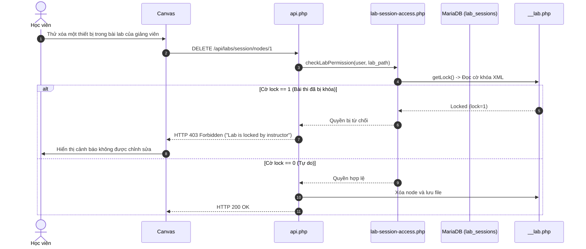

# SƠ ĐỒ TRÌNH TỰ (SEQUENCE DIAGRAM): F24 - LAB SESSION LOCKING

```mermaid
sequenceDiagram
    autonumber
    actor User as Học viên
    participant UI as Canvas
    participant API as api.php
    participant Access as lab-session-access.php
    participant DB as MariaDB (lab_sessions)
    participant LabModel as __lab.php

    User->>UI: Thử xóa một thiết bị trong bài lab của giảng viên
    UI->>API: DELETE /api/labs/session/nodes/1
    API->>Access: checkLabPermission(user, lab_path)
    Access->>LabModel: getLock() -> Đọc cờ khóa XML
    alt Cờ lock == 1 (Bài thi đã bị khóa)
        LabModel-->>Access: Locked (lock=1)
        Access-->>API: Quyền bị từ chối
        API-->>UI: HTTP 403 Forbidden ("Lab is locked by instructor")
        UI->>User: Hiển thị cảnh báo không được chỉnh sửa
    else Cờ lock == 0 (Tự do)
        Access-->>API: Quyền hợp lệ
        API->>LabModel: Xóa node và lưu file
        API-->>UI: HTTP 200 OK
    end
```
