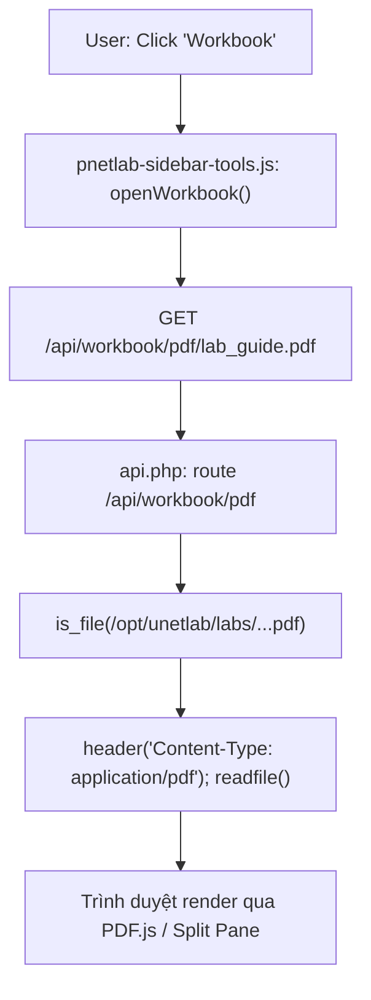

# SƠ ĐỒ GỌI HÀM (CALL GRAPH): F25 - WORKBOOK VIEWER

```mermaid
graph TD
    CLICK_BTN["User: Click 'Workbook'"] --> SIDEBAR_JS["pnetlab-sidebar-tools.js: openWorkbook()"]
    SIDEBAR_JS --> FETCH_PDF["GET /api/workbook/pdf/lab_guide.pdf"]
    FETCH_PDF --> API_ROUTER["api.php: route /api/workbook/pdf"]
    API_ROUTER --> CHECK_FILE["is_file(/opt/unetlab/labs/...pdf)"]
    CHECK_FILE --> STREAM_FILE["header('Content-Type: application/pdf'); readfile()"]
    STREAM_FILE --> PDF_RENDER["Trình duyệt render qua PDF.js / Split Pane"]
```
