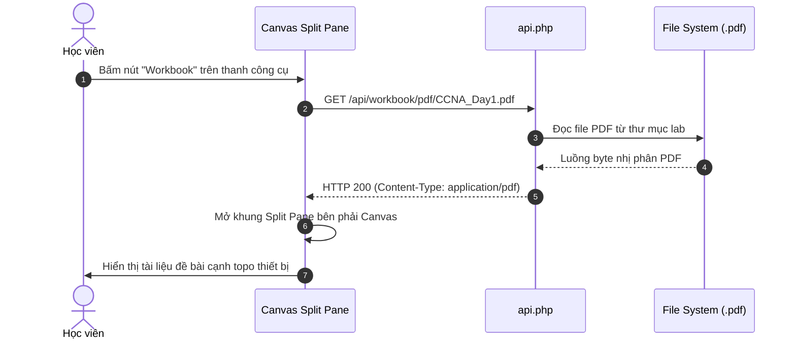

# SƠ ĐỒ TRÌNH TỰ (SEQUENCE DIAGRAM): F25 - WORKBOOK VIEWER

```mermaid
sequenceDiagram
    autonumber
    actor User as Học viên
    participant UI as Canvas Split Pane
    participant API as api.php
    participant Storage as File System (.pdf)

    User->>UI: Bấm nút "Workbook" trên thanh công cụ
    UI->>API: GET /api/workbook/pdf/CCNA_Day1.pdf
    API->>Storage: Đọc file PDF từ thư mục lab
    Storage-->>API: Luồng byte nhị phân PDF
    API-->>UI: HTTP 200 (Content-Type: application/pdf)
    UI->>UI: Mở khung Split Pane bên phải Canvas
    UI->>User: Hiển thị tài liệu đề bài cạnh topo thiết bị
```
