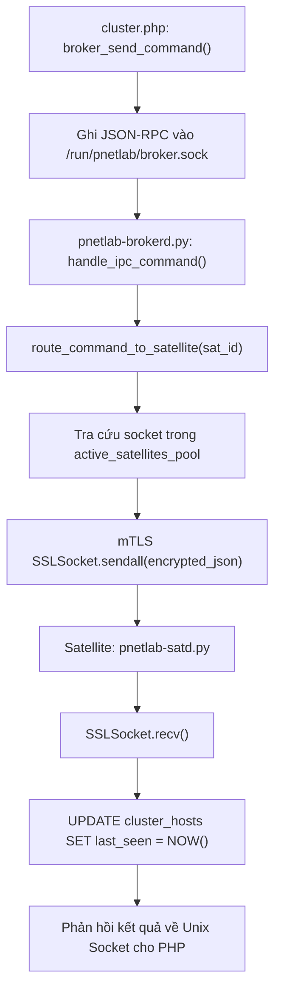

# SƠ ĐỒ GỌI HÀM (CALL GRAPH): F26 - CLUSTER BROKER DAEMON

```mermaid
graph TD
    PHP_API["cluster.php: broker_send_command()"] --> UNIX_SOCK["Ghi JSON-RPC vào /run/pnetlab/broker.sock"]
    UNIX_SOCK --> BROKER["pnetlab-brokerd.py: handle_ipc_command()"]
    BROKER --> ROUTE_CMD["route_command_to_satellite(sat_id)"]
    ROUTE_CMD --> POOL["Tra cứu socket trong active_satellites_pool"]
    POOL --> MTLS_SEND["mTLS SSLSocket.sendall(encrypted_json)"]
    MTLS_SEND --> SAT_RECV["Satellite: pnetlab-satd.py"]
    SAT_RECV --> MTLS_RESP["SSLSocket.recv()"]
    MTLS_RESP --> UPDATE_DB["UPDATE cluster_hosts SET last_seen = NOW()"]
    UPDATE_DB --> RESP_PHP["Phản hồi kết quả về Unix Socket cho PHP"]
```
