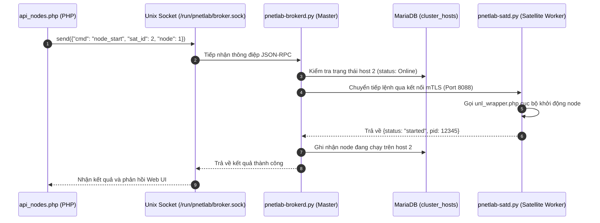

# SƠ ĐỒ TRÌNH TỰ (SEQUENCE DIAGRAM): F26 - CLUSTER BROKER DAEMON

```mermaid
sequenceDiagram
    autonumber
    participant PHP as api_nodes.php (PHP)
    participant IPC as Unix Socket (/run/pnetlab/broker.sock)
    participant Broker as pnetlab-brokerd.py (Master)
    participant DB as MariaDB (cluster_hosts)
    participant Sat as pnetlab-satd.py (Satellite Worker)

    PHP->>IPC: send({"cmd": "node_start", "sat_id": 2, "node": 1})
    IPC->>Broker: Tiếp nhận thông điệp JSON-RPC
    Broker->>DB: Kiểm tra trạng thái host 2 (status: Online)
    Broker->>Sat: Chuyển tiếp lệnh qua kết nối mTLS (Port 8088)
    Sat->>Sat: Gọi unl_wrapper.php cục bộ khởi động node
    Sat-->>Broker: Trả về {status: "started", pid: 12345}
    Broker->>DB: Ghi nhận node đang chạy trên host 2
    Broker-->>IPC: Trả về kết quả thành công
    IPC-->>PHP: Nhận kết quả và phản hồi Web UI
```
