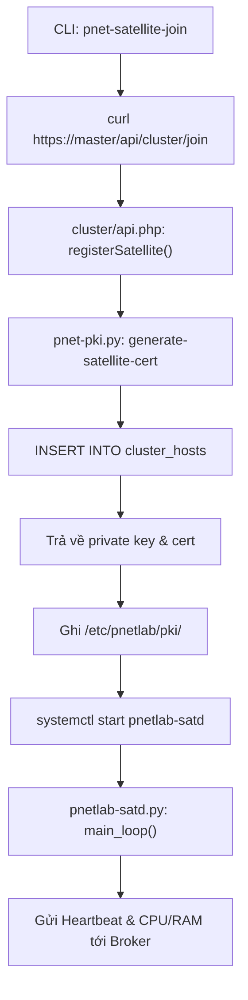

# SƠ ĐỒ GỌI HÀM (CALL GRAPH): F27 - SATELLITE LIFECYCLE

```mermaid
graph TD
    CLI["CLI: pnet-satellite-join"] --> HTTP_HANDSHAKE["curl https://master/api/cluster/join"]
    HTTP_HANDSHAKE --> MASTER_API["cluster/api.php: registerSatellite()"]
    MASTER_API --> GEN_CERT["pnet-pki.py: generate-satellite-cert"]
    GEN_CERT --> SAVE_HOST["INSERT INTO cluster_hosts"]
    SAVE_HOST --> RETURN_KEYS["Trả về private key & cert"]
    RETURN_KEYS --> WRITE_FILES["Ghi /etc/pnetlab/pki/"]
    WRITE_FILES --> START_SVC["systemctl start pnetlab-satd"]
    START_SVC --> SAT_LOOP["pnetlab-satd.py: main_loop()"]
    SAT_LOOP --> SEND_HB["Gửi Heartbeat & CPU/RAM tới Broker"]
```
