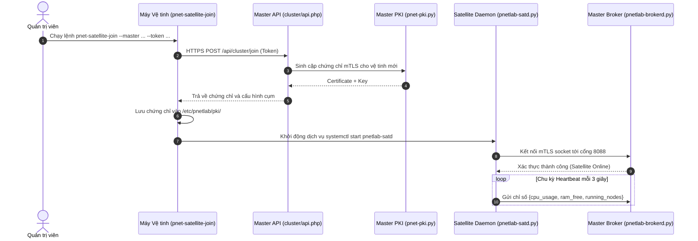

# SƠ ĐỒ TRÌNH TỰ (SEQUENCE DIAGRAM): F27 - SATELLITE LIFECYCLE

```mermaid
sequenceDiagram
    autonumber
    actor Admin as Quản trị viên
    participant SatCLI as Máy Vệ tinh (pnet-satellite-join)
    participant MasterAPI as Master API (cluster/api.php)
    participant PKI as Master PKI (pnet-pki.py)
    participant Satd as Satellite Daemon (pnetlab-satd.py)
    participant Broker as Master Broker (pnetlab-brokerd.py)

    Admin->>SatCLI: Chạy lệnh pnet-satellite-join --master ... --token ...
    SatCLI->>MasterAPI: HTTPS POST /api/cluster/join (Token)
    MasterAPI->>PKI: Sinh cặp chứng chỉ mTLS cho vệ tinh mới
    PKI-->>MasterAPI: Certificate + Key
    MasterAPI-->>SatCLI: Trả về chứng chỉ và cấu hình cụm
    SatCLI->>SatCLI: Lưu chứng chỉ vào /etc/pnetlab/pki/
    SatCLI->>Satd: Khởi động dịch vụ systemctl start pnetlab-satd
    Satd->>Broker: Kết nối mTLS socket tới cổng 8088
    Broker-->>Satd: Xác thực thành công (Satellite Online)
    loop Chu kỳ Heartbeat mỗi 3 giây
        Satd->>Broker: Gửi chỉ số {cpu_usage, ram_free, running_nodes}
    end
```
