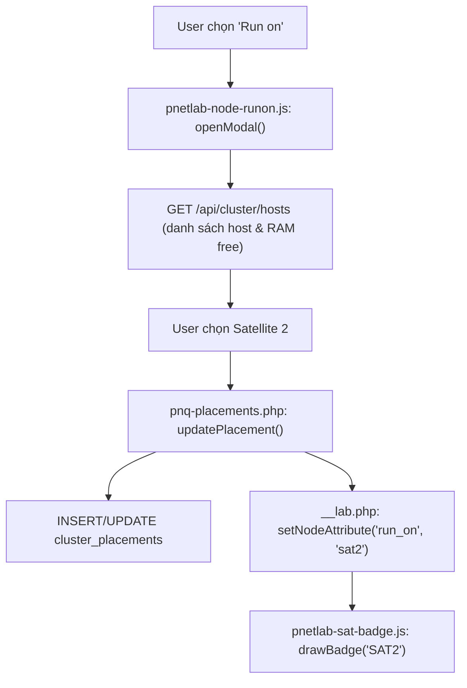

# SƠ ĐỒ GỌI HÀM (CALL GRAPH): F28 - NODE CLUSTER PLACEMENT

```mermaid
graph TD
    CLICK["User chọn 'Run on'"] --> MODAL["pnetlab-node-runon.js: openModal()"]
    MODAL --> FETCH_HOSTS["GET /api/cluster/hosts (danh sách host & RAM free)"]
    FETCH_HOSTS --> USER_SELECT["User chọn Satellite 2"]
    USER_SELECT --> POST_API["pnq-placements.php: updatePlacement()"]
    POST_API --> DB_SAVE["INSERT/UPDATE cluster_placements"]
    POST_API --> XML_SAVE["__lab.php: setNodeAttribute('run_on', 'sat2')"]
    XML_SAVE --> DRAW_BADGE["pnetlab-sat-badge.js: drawBadge('SAT2')"]
```
