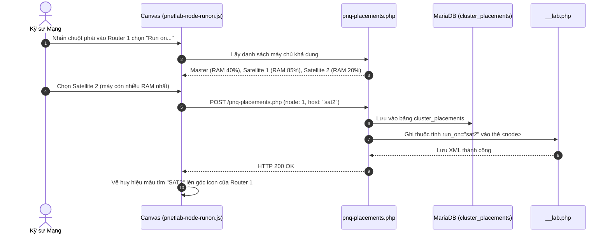

# SƠ ĐỒ TRÌNH TỰ (SEQUENCE DIAGRAM): F28 - NODE CLUSTER PLACEMENT

```mermaid
sequenceDiagram
    autonumber
    actor User as Kỹ sư Mạng
    participant UI as Canvas (pnetlab-node-runon.js)
    participant API as pnq-placements.php
    participant DB as MariaDB (cluster_placements)
    participant LabModel as __lab.php

    User->>UI: Nhấn chuột phải vào Router 1 chọn "Run on..."
    UI->>API: Lấy danh sách máy chủ khả dụng
    API-->>UI: Master (RAM 40%), Satellite 1 (RAM 85%), Satellite 2 (RAM 20%)
    User->>UI: Chọn Satellite 2 (máy còn nhiều RAM nhất)
    UI->>API: POST /pnq-placements.php (node: 1, host: "sat2")
    API->>DB: Lưu vào bảng cluster_placements
    API->>LabModel: Ghi thuộc tính run_on="sat2" vào thẻ <node>
    LabModel-->>API: Lưu XML thành công
    API-->>UI: HTTP 200 OK
    UI->>UI: Vẽ huy hiệu màu tím "SAT2" lên góc icon của Router 1
```
