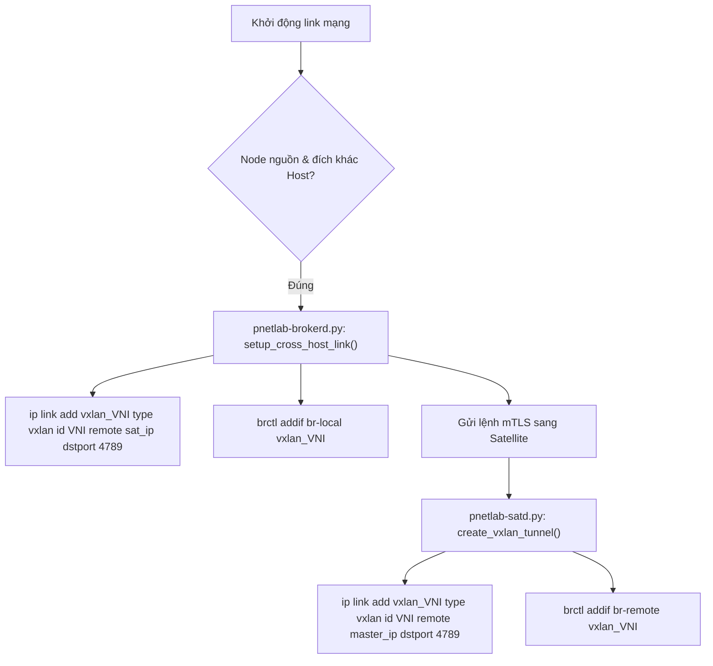

# SƠ ĐỒ GỌI HÀM (CALL GRAPH): F29 - CROSS-BRIDGE SYNC

```mermaid
graph TD
    START_LINK["Khởi động link mạng"] --> CHECK_HOSTS{"Node nguồn & đích khác Host?"}
    CHECK_HOSTS -- Đúng --> BROKER["pnetlab-brokerd.py: setup_cross_host_link()"]
    BROKER --> LOCAL_VXLAN["ip link add vxlan_VNI type vxlan id VNI remote sat_ip dstport 4789"]
    BROKER --> BR_ADD_LOCAL["brctl addif br-local vxlan_VNI"]
    BROKER --> REMOTE_CMD["Gửi lệnh mTLS sang Satellite"]
    REMOTE_CMD --> SATD["pnetlab-satd.py: create_vxlan_tunnel()"]
    SATD --> REMOTE_VXLAN["ip link add vxlan_VNI type vxlan id VNI remote master_ip dstport 4789"]
    SATD --> BR_ADD_REMOTE["brctl addif br-remote vxlan_VNI"]
```
