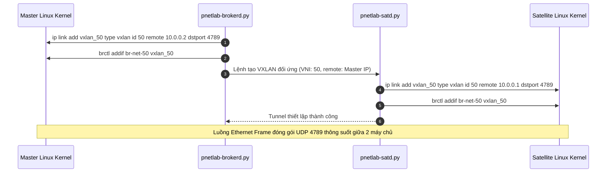

# SƠ ĐỒ TRÌNH TỰ (SEQUENCE DIAGRAM): F29 - CROSS-BRIDGE SYNC

```mermaid
sequenceDiagram
    autonumber
    participant MasterKernel as Master Linux Kernel
    participant Broker as pnetlab-brokerd.py
    participant Satd as pnetlab-satd.py
    participant SatKernel as Satellite Linux Kernel

    Broker->>MasterKernel: ip link add vxlan_50 type vxlan id 50 remote 10.0.0.2 dstport 4789
    Broker->>MasterKernel: brctl addif br-net-50 vxlan_50
    Broker->>Satd: Lệnh tạo VXLAN đối ứng (VNI: 50, remote: Master IP)
    Satd->>SatKernel: ip link add vxlan_50 type vxlan id 50 remote 10.0.0.1 dstport 4789
    Satd->>SatKernel: brctl addif br-net-50 vxlan_50
    Satd-->>Broker: Tunnel thiết lập thành công
    Note over MasterKernel,SatKernel: Luồng Ethernet Frame đóng gói UDP 4789 thông suốt giữa 2 máy chủ
```
