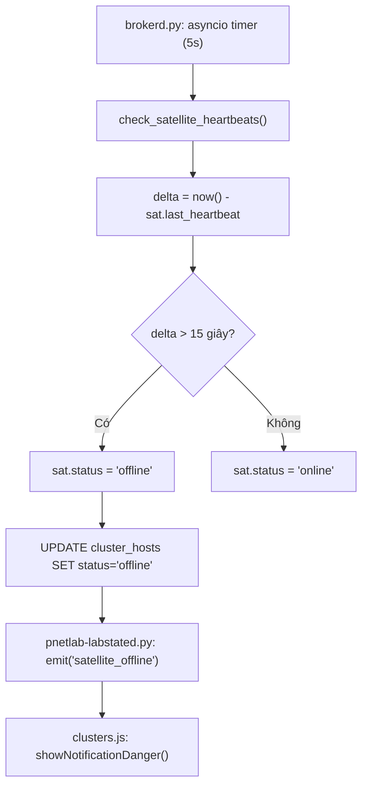

# SƠ ĐỒ GỌI HÀM (CALL GRAPH): F30 - CLUSTER HEALTH & FAILOVER

```mermaid
graph TD
    LOOP["brokerd.py: asyncio timer (5s)"] --> CHECK_ALL["check_satellite_heartbeats()"]
    CHECK_ALL --> CALC_DIFF["delta = now() - sat.last_heartbeat"]
    CALC_DIFF --> EVAL{"delta > 15 giây?"}
    EVAL -- Có --> MARK_OFFLINE["sat.status = 'offline'"]
    MARK_OFFLINE --> DB_UPDATE["UPDATE cluster_hosts SET status='offline'"]
    DB_UPDATE --> EMIT_ALERT["pnetlab-labstated.py: emit('satellite_offline')"]
    EMIT_ALERT --> UI_ALERT["clusters.js: showNotificationDanger()"]
    EVAL -- Không --> KEEP_ONLINE["sat.status = 'online'"]
```
