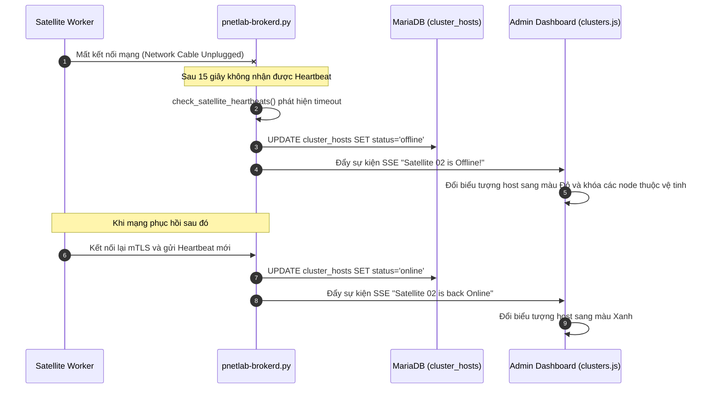

# SƠ ĐỒ TRÌNH TỰ (SEQUENCE DIAGRAM): F30 - CLUSTER HEALTH & FAILOVER

```mermaid
sequenceDiagram
    autonumber
    participant Sat as Satellite Worker
    participant Broker as pnetlab-brokerd.py
    participant DB as MariaDB (cluster_hosts)
    participant UI as Admin Dashboard (clusters.js)

    Sat-xBroker: Mất kết nối mạng (Network Cable Unplugged)
    Note over Broker: Sau 15 giây không nhận được Heartbeat
    Broker->>Broker: check_satellite_heartbeats() phát hiện timeout
    Broker->>DB: UPDATE cluster_hosts SET status='offline'
    Broker->>UI: Đẩy sự kiện SSE "Satellite 02 is Offline!"
    UI->>UI: Đổi biểu tượng host sang màu Đỏ và khóa các node thuộc vệ tinh
    Note over Sat,Broker: Khi mạng phục hồi sau đó
    Sat->>Broker: Kết nối lại mTLS và gửi Heartbeat mới
    Broker->>DB: UPDATE cluster_hosts SET status='online'
    Broker->>UI: Đẩy sự kiện SSE "Satellite 02 is back Online"
    UI->>UI: Đổi biểu tượng host sang màu Xanh
```
