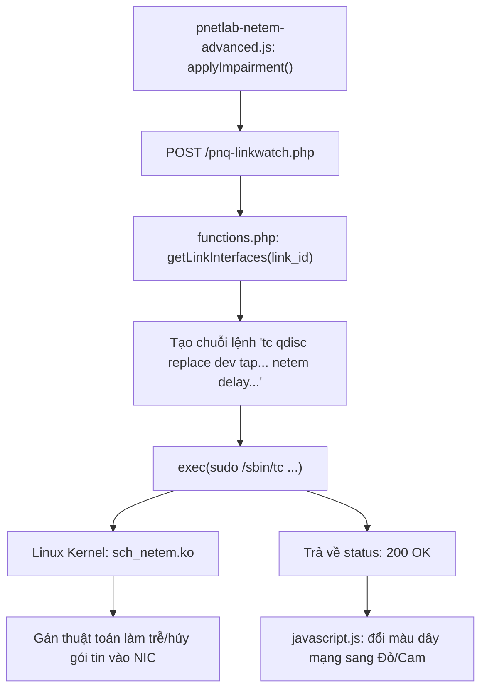

# SƠ ĐỒ GỌI HÀM (CALL GRAPH): F31 - NETEM LINK IMPAIRMENT

```mermaid
graph TD
    UI["pnetlab-netem-advanced.js: applyImpairment()"] --> POST_API["POST /pnq-linkwatch.php"]
    POST_API --> RESOLVE_TAPS["functions.php: getLinkInterfaces(link_id)"]
    RESOLVE_TAPS --> BUILD_TC["Tạo chuỗi lệnh 'tc qdisc replace dev tap... netem delay...'"]
    BUILD_TC --> EXEC_TC["exec(sudo /sbin/tc ...)"]
    EXEC_TC --> KERNEL_SCHED["Linux Kernel: sch_netem.ko"]
    KERNEL_SCHED --> APPLY_QUEUE["Gán thuật toán làm trễ/hủy gói tin vào NIC"]
    EXEC_TC --> RESP["Trả về status: 200 OK"]
    RESP --> UPDATE_CANVAS["javascript.js: đổi màu dây mạng sang Đỏ/Cam"]
```
