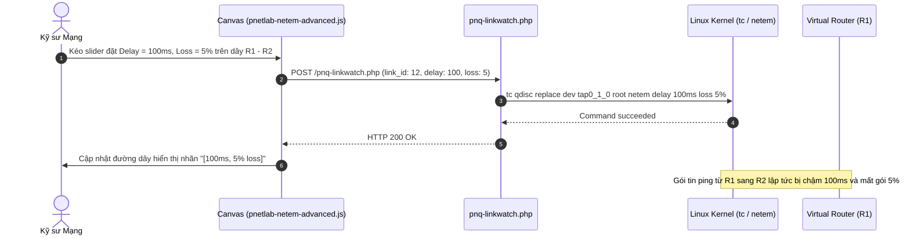

# SƠ ĐỒ TRÌNH TỰ (SEQUENCE DIAGRAM): F31 - NETEM LINK IMPAIRMENT

```mermaid
sequenceDiagram
    autonumber
    actor User as Kỹ sư Mạng
    participant UI as Canvas (pnetlab-netem-advanced.js)
    participant API as pnq-linkwatch.php
    participant KernelNet as Linux Kernel (tc / netem)
    participant Router as Virtual Router (R1)

    User->>UI: Kéo slider đặt Delay = 100ms, Loss = 5% trên dây R1 - R2
    UI->>API: POST /pnq-linkwatch.php (link_id: 12, delay: 100, loss: 5)
    API->>KernelNet: tc qdisc replace dev tap0_1_0 root netem delay 100ms loss 5%
    KernelNet-->>API: Command succeeded
    API-->>UI: HTTP 200 OK
    UI->>User: Cập nhật đường dây hiển thị nhãn "[100ms, 5% loss]"
    Note over Router,KernelNet: Gói tin ping từ R1 sang R2 lập tức bị chậm 100ms và mất gói 5%
```
