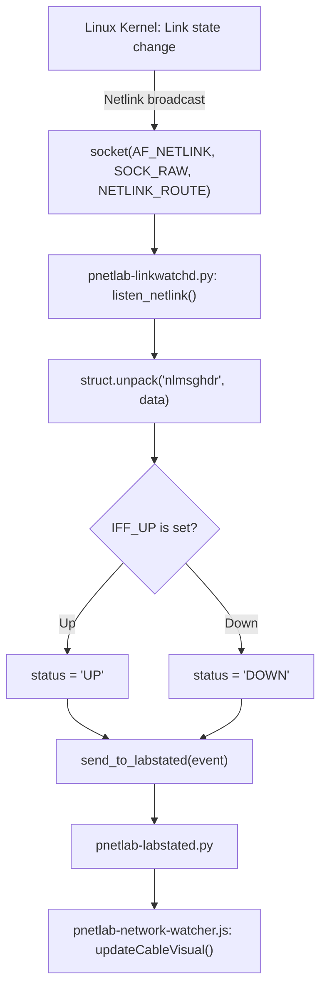

# SƠ ĐỒ GỌI HÀM (CALL GRAPH): F32 - LINKWATCH DAEMON

```mermaid
graph TD
    KERNEL["Linux Kernel: Link state change"] -->|Netlink broadcast| SOCK["socket(AF_NETLINK, SOCK_RAW, NETLINK_ROUTE)"]
    SOCK --> RECV["pnetlab-linkwatchd.py: listen_netlink()"]
    RECV --> PARSE["struct.unpack('nlmsghdr', data)"]
    PARSE --> CHECK_FLAG{"IFF_UP is set?"}
    CHECK_FLAG -- Up --> STATUS_UP["status = 'UP'"]
    CHECK_FLAG -- Down --> STATUS_DOWN["status = 'DOWN'"]
    STATUS_UP --> BROADCAST["send_to_labstated(event)"]
    STATUS_DOWN --> BROADCAST
    BROADCAST --> SSE["pnetlab-labstated.py"]
    SSE --> UI["pnetlab-network-watcher.js: updateCableVisual()"]
```
