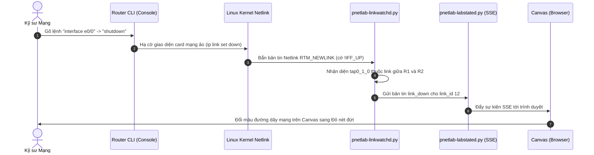

# SƠ ĐỒ TRÌNH TỰ (SEQUENCE DIAGRAM): F32 - LINKWATCH DAEMON

```mermaid
sequenceDiagram
    autonumber
    actor User as Kỹ sư Mạng
    participant Router as Router CLI (Console)
    participant Kernel as Linux Kernel Netlink
    participant Daemon as pnetlab-linkwatchd.py
    participant Labstate as pnetlab-labstated.py (SSE)
    participant UI as Canvas (Browser)

    User->>Router: Gõ lệnh "interface e0/0" -> "shutdown"
    Router->>Kernel: Hạ cờ giao diện card mạng ảo (ip link set down)
    Kernel->>Daemon: Bắn bản tin Netlink RTM_NEWLINK (cờ !IFF_UP)
    Daemon->>Daemon: Nhận diện tap0_1_0 thuộc link giữa R1 và R2
    Daemon->>Labstate: Gửi bản tin link_down cho link_id 12
    Labstate->>UI: Đẩy sự kiện SSE tới trình duyệt
    UI->>User: Đổi màu đường dây mạng trên Canvas sang Đỏ nét đứt
```
