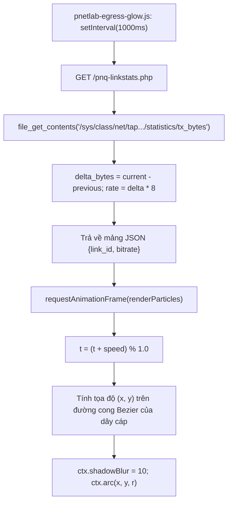

# SƠ ĐỒ GỌI HÀM (CALL GRAPH): F33 - EGRESS GLOW & STATS

```mermaid
graph TD
    TIMER["pnetlab-egress-glow.js: setInterval(1000ms)"] --> FETCH["GET /pnq-linkstats.php"]
    FETCH --> READ_SYSFS["file_get_contents('/sys/class/net/tap.../statistics/tx_bytes')"]
    READ_SYSFS --> CALC_DELTA["delta_bytes = current - previous; rate = delta * 8"]
    CALC_DELTA --> RESP_JSON["Trả về mảng JSON {link_id, bitrate}"]
    RESP_JSON --> ANIM_LOOP["requestAnimationFrame(renderParticles)"]
    ANIM_LOOP --> UPDATE_PARTICLE["t = (t + speed) % 1.0"]
    UPDATE_PARTICLE --> CALC_BEZIER["Tính tọa độ (x, y) trên đường cong Bezier của dây cáp"]
    CALC_BEZIER --> DRAW_GLOW["ctx.shadowBlur = 10; ctx.arc(x, y, r)"]
```
