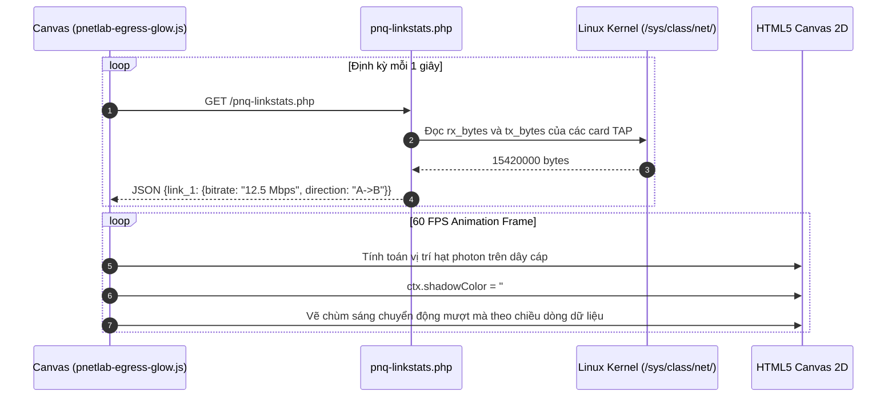

# SƠ ĐỒ TRÌNH TỰ (SEQUENCE DIAGRAM): F33 - EGRESS GLOW & STATS

```mermaid
sequenceDiagram
    autonumber
    participant UI as Canvas (pnetlab-egress-glow.js)
    participant API as pnq-linkstats.php
    participant Sysfs as Linux Kernel (/sys/class/net/)
    participant Canvas as HTML5 Canvas 2D

    loop Định kỳ mỗi 1 giây
        UI->>API: GET /pnq-linkstats.php
        API->>Sysfs: Đọc rx_bytes và tx_bytes của các card TAP
        Sysfs-->>API: 15420000 bytes
        API-->>UI: JSON {link_1: {bitrate: "12.5 Mbps", direction: "A->B"}}
    end
    loop 60 FPS Animation Frame
        UI->>Canvas: Tính toán vị trí hạt photon trên dây cáp
        UI->>Canvas: ctx.shadowColor = "#00ffcc"; ctx.fill()
        UI->>Canvas: Vẽ chùm sáng chuyển động mượt mà theo chiều dòng dữ liệu
    end
```
