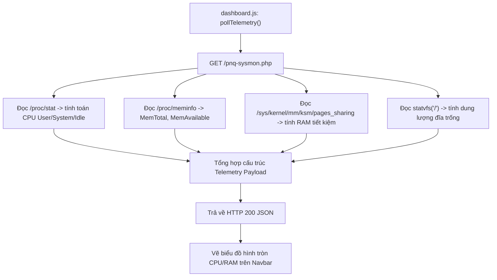

# SƠ ĐỒ GỌI HÀM (CALL GRAPH): F35 - HOST SYSTEM TELEMETRY

```mermaid
graph TD
    DASHBOARD["dashboard.js: pollTelemetry()"] --> API["GET /pnq-sysmon.php"]
    API --> READ_STAT["Đọc /proc/stat -> tính toán CPU User/System/Idle"]
    API --> READ_MEM["Đọc /proc/meminfo -> MemTotal, MemAvailable"]
    API --> READ_KSM["Đọc /sys/kernel/mm/ksm/pages_sharing -> tính RAM tiết kiệm"]
    API --> READ_DISK["Đọc statvfs('/') -> tính dung lượng đĩa trống"]
    READ_STAT --> AGGREGATE["Tổng hợp cấu trúc Telemetry Payload"]
    READ_MEM --> AGGREGATE
    READ_KSM --> AGGREGATE
    READ_DISK --> AGGREGATE
    AGGREGATE --> RETURN_JSON["Trả về HTTP 200 JSON"]
    RETURN_JSON --> RENDER_GAUGES["Vẽ biểu đồ hình tròn CPU/RAM trên Navbar"]
```
