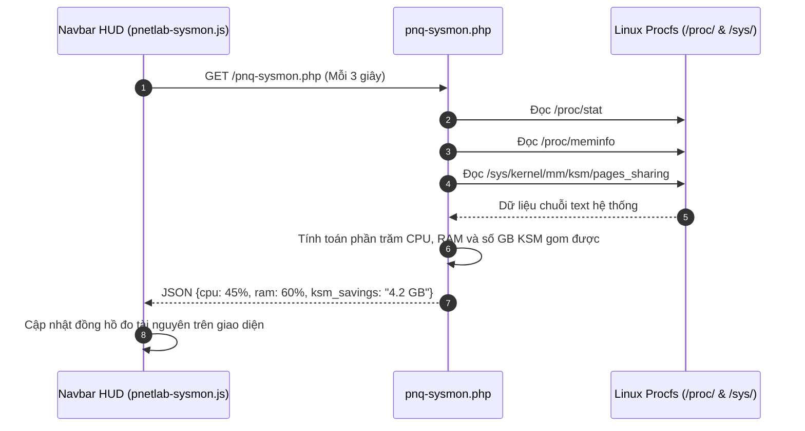

# SƠ ĐỒ TRÌNH TỰ (SEQUENCE DIAGRAM): F35 - HOST SYSTEM TELEMETRY

```mermaid
sequenceDiagram
    autonumber
    participant UI as Navbar HUD (pnetlab-sysmon.js)
    participant API as pnq-sysmon.php
    participant Kernel as Linux Procfs (/proc/ & /sys/)

    UI->>API: GET /pnq-sysmon.php (Mỗi 3 giây)
    API->>Kernel: Đọc /proc/stat
    API->>Kernel: Đọc /proc/meminfo
    API->>Kernel: Đọc /sys/kernel/mm/ksm/pages_sharing
    Kernel-->>API: Dữ liệu chuỗi text hệ thống
    API->>API: Tính toán phần trăm CPU, RAM và số GB KSM gom được
    API-->>UI: JSON {cpu: 45%, ram: 60%, ksm_savings: "4.2 GB"}
    UI->>UI: Cập nhật đồng hồ đo tài nguyên trên giao diện
```
