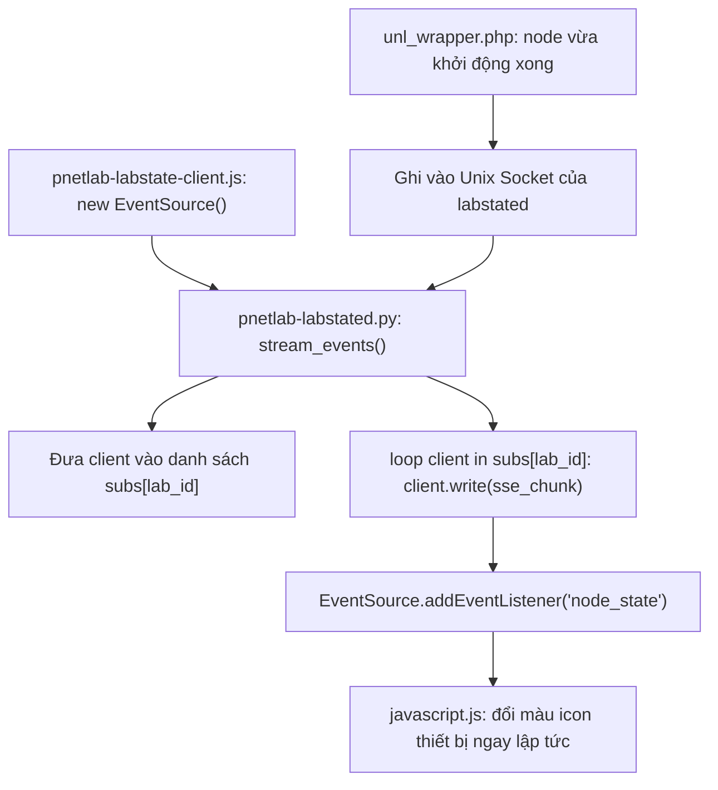

# SƠ ĐỒ GỌI HÀM (CALL GRAPH): F36 - REALTIME LABSTATE SSE

```mermaid
graph TD
    CLIENT["pnetlab-labstate-client.js: new EventSource()"] --> SSE_DAEMON["pnetlab-labstated.py: stream_events()"]
    SSE_DAEMON --> REG_CLIENT["Đưa client vào danh sách subs[lab_id]"]
    
    EVENT_SRC["unl_wrapper.php: node vừa khởi động xong"] --> NOTIF_SOCK["Ghi vào Unix Socket của labstated"]
    NOTIF_SOCK --> SSE_DAEMON
    SSE_DAEMON --> BROADCAST["loop client in subs[lab_id]: client.write(sse_chunk)"]
    BROADCAST --> CLIENT_RECV["EventSource.addEventListener('node_state')"]
    CLIENT_RECV --> UPDATE_CANVAS["javascript.js: đổi màu icon thiết bị ngay lập tức"]
```
