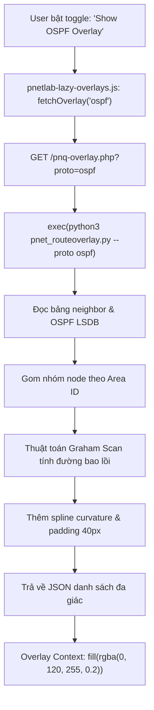

# SƠ ĐỒ GỌI HÀM (CALL GRAPH): F37 - ROUTING PROTOCOL OVERLAY

```mermaid
graph TD
    CLICK["User bật toggle: 'Show OSPF Overlay'"] --> LAZY_JS["pnetlab-lazy-overlays.js: fetchOverlay('ospf')"]
    LAZY_JS --> API["GET /pnq-overlay.php?proto=ospf"]
    API --> PY_ENGINE["exec(python3 pnet_routeoverlay.py --proto ospf)"]
    PY_ENGINE --> READ_NEIGHBORS["Đọc bảng neighbor & OSPF LSDB"]
    READ_NEIGHBORS --> GROUP_NODES["Gom nhóm node theo Area ID"]
    GROUP_NODES --> CONVEX_HULL["Thuật toán Graham Scan tính đường bao lồi"]
    CONVEX_HULL --> ADD_PADDING["Thêm spline curvature & padding 40px"]
    ADD_PADDING --> RESP_JSON["Trả về JSON danh sách đa giác"]
    RESP_JSON --> DRAW_CANVAS["Overlay Context: fill(rgba(0, 120, 255, 0.2))"]
```
