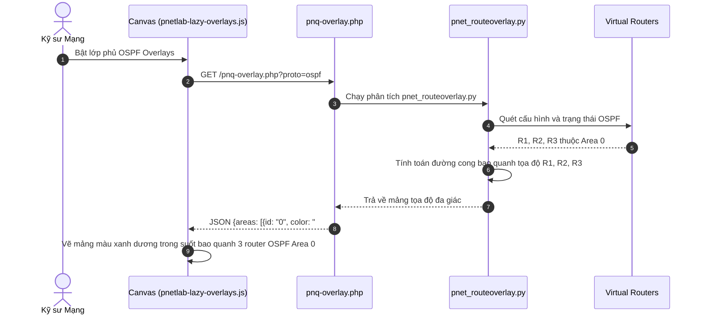

# SƠ ĐỒ TRÌNH TỰ (SEQUENCE DIAGRAM): F37 - ROUTING PROTOCOL OVERLAY

```mermaid
sequenceDiagram
    autonumber
    actor User as Kỹ sư Mạng
    participant UI as Canvas (pnetlab-lazy-overlays.js)
    participant API as pnq-overlay.php
    participant Python as pnet_routeoverlay.py
    participant Routers as Virtual Routers

    User->>UI: Bật lớp phủ OSPF Overlays
    UI->>API: GET /pnq-overlay.php?proto=ospf
    API->>Python: Chạy phân tích pnet_routeoverlay.py
    Python->>Routers: Quét cấu hình và trạng thái OSPF
    Routers-->>Python: R1, R2, R3 thuộc Area 0
    Python->>Python: Tính toán đường cong bao quanh tọa độ R1, R2, R3
    Python-->>API: Trả về mảng tọa độ đa giác
    API-->>UI: JSON {areas: [{id: "0", color: "#0078ff", polygon: [...]}]}
    UI->>UI: Vẽ mảng màu xanh dương trong suốt bao quanh 3 router OSPF Area 0
```
