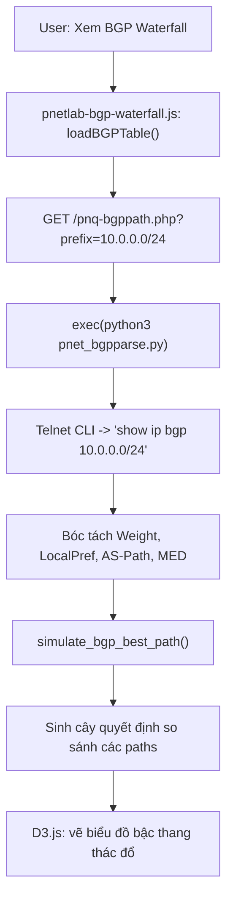

# SƠ ĐỒ GỌI HÀM (CALL GRAPH): F38 - BGP WATERFALL

```mermaid
graph TD
    CLICK["User: Xem BGP Waterfall"] --> UI["pnetlab-bgp-waterfall.js: loadBGPTable()"]
    UI --> API["GET /pnq-bgppath.php?prefix=10.0.0.0/24"]
    API --> PARSER["exec(python3 pnet_bgpparse.py)"]
    PARSER --> FETCH_CLI["Telnet CLI -> 'show ip bgp 10.0.0.0/24'"]
    FETCH_CLI --> REGEX_PARSE["Bóc tách Weight, LocalPref, AS-Path, MED"]
    REGEX_PARSE --> EVAL_BEST["simulate_bgp_best_path()"]
    EVAL_BEST --> JSON_TREE["Sinh cây quyết định so sánh các paths"]
    JSON_TREE --> RENDER_D3["D3.js: vẽ biểu đồ bậc thang thác đổ"]
```
