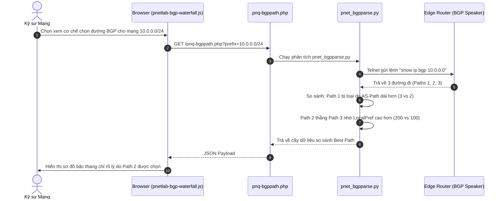

# SƠ ĐỒ TRÌNH TỰ (SEQUENCE DIAGRAM): F38 - BGP WATERFALL

```mermaid
sequenceDiagram
    autonumber
    actor User as Kỹ sư Mạng
    participant UI as Browser (pnetlab-bgp-waterfall.js)
    participant API as pnq-bgppath.php
    participant Python as pnet_bgpparse.py
    participant Router as Edge Router (BGP Speaker)

    User->>UI: Chọn xem cơ chế chọn đường BGP cho mạng 10.0.0.0/24
    UI->>API: GET /pnq-bgppath.php?prefix=10.0.0.0/24
    API->>Python: Chạy phân tích pnet_bgpparse.py
    Python->>Router: Telnet gửi lệnh "show ip bgp 10.0.0.0"
    Router-->>Python: Trả về 3 đường đi (Paths 1, 2, 3)
    Python->>Python: So sánh: Path 1 bị loại do AS-Path dài hơn (3 vs 2)
    Python->>Python: Path 2 thắng Path 3 nhờ LocalPref cao hơn (200 vs 100)
    Python-->>API: Trả về cây dữ liệu so sánh Best Path
    API-->>UI: JSON Payload
    UI->>User: Hiển thị sơ đồ bậc thang chỉ rõ lý do Path 2 được chọn
```
