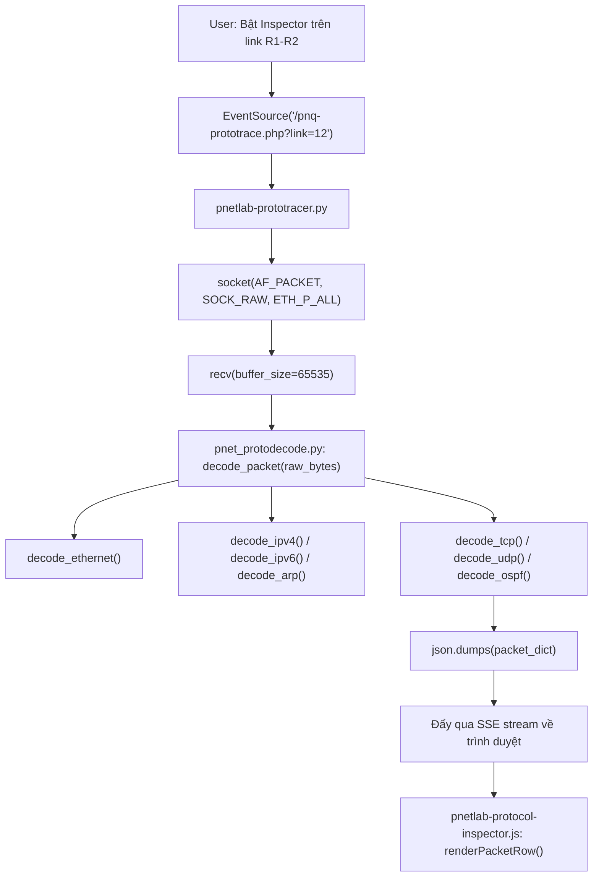

# SƠ ĐỒ GỌI HÀM (CALL GRAPH): F39 - PACKET PROTOTRACER

```mermaid
graph TD
    UI_OPEN["User: Bật Inspector trên link R1-R2"] --> SSE_SUB["EventSource('/pnq-prototrace.php?link=12')"]
    SSE_SUB --> DAEMON["pnetlab-prototracer.py"]
    DAEMON --> RAW_SOCK["socket(AF_PACKET, SOCK_RAW, ETH_P_ALL)"]
    RAW_SOCK --> RECV_FRAME["recv(buffer_size=65535)"]
    RECV_FRAME --> DECODER["pnet_protodecode.py: decode_packet(raw_bytes)"]
    DECODER --> DECODE_L2["decode_ethernet()"]
    DECODER --> DECODE_L3["decode_ipv4() / decode_ipv6() / decode_arp()"]
    DECODER --> DECODE_L4["decode_tcp() / decode_udp() / decode_ospf()"]
    DECODE_L4 --> PACK_JSON["json.dumps(packet_dict)"]
    PACK_JSON --> SSE_PUSH["Đẩy qua SSE stream về trình duyệt"]
    SSE_PUSH --> UI_INSPECT["pnetlab-protocol-inspector.js: renderPacketRow()"]
```
