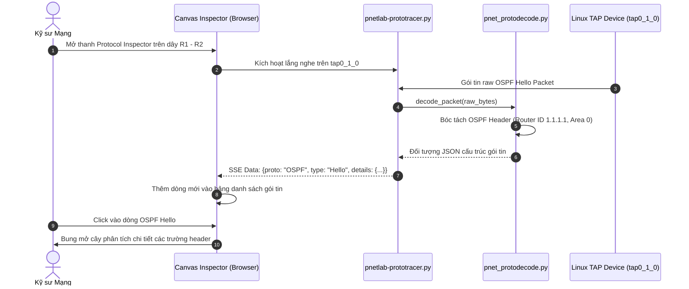

# SƠ ĐỒ TRÌNH TỰ (SEQUENCE DIAGRAM): F39 - PACKET PROTOTRACER

```mermaid
sequenceDiagram
    autonumber
    actor User as Kỹ sư Mạng
    participant UI as Canvas Inspector (Browser)
    participant Tracer as pnetlab-prototracer.py
    participant Decoder as pnet_protodecode.py
    participant Kernel as Linux TAP Device (tap0_1_0)

    User->>UI: Mở thanh Protocol Inspector trên dây R1 - R2
    UI->>Tracer: Kích hoạt lắng nghe trên tap0_1_0
    Kernel->>Tracer: Gói tin raw OSPF Hello Packet
    Tracer->>Decoder: decode_packet(raw_bytes)
    Decoder->>Decoder: Bóc tách OSPF Header (Router ID 1.1.1.1, Area 0)
    Decoder-->>Tracer: Đối tượng JSON cấu trúc gói tin
    Tracer-->>UI: SSE Data: {proto: "OSPF", type: "Hello", details: {...}}
    UI->>UI: Thêm dòng mới vào bảng danh sách gói tin
    User->>UI: Click vào dòng OSPF Hello
    UI->>User: Bung mở cây phân tích chi tiết các trường header
```
