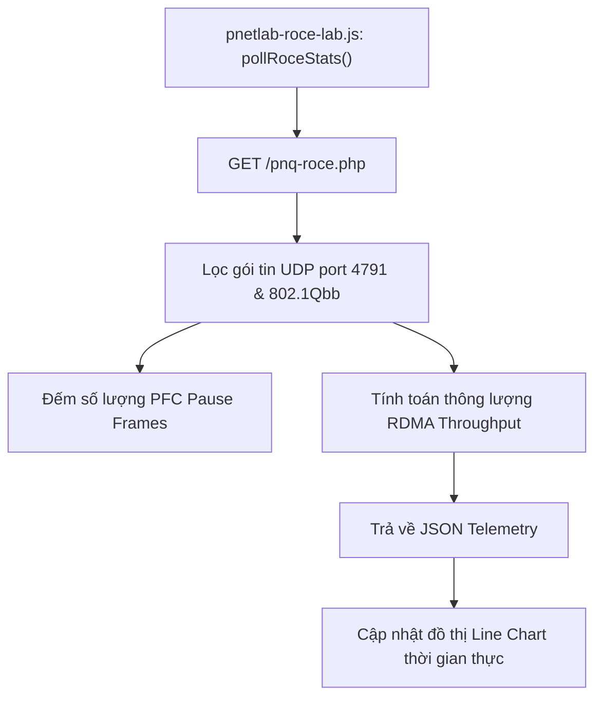

# SƠ ĐỒ GỌI HÀM (CALL GRAPH): F40 - ROCE RDMA TELEMETRY

```mermaid
graph TD
    UI["pnetlab-roce-lab.js: pollRoceStats()"] --> API["GET /pnq-roce.php"]
    API --> FILTER_RDMA["Lọc gói tin UDP port 4791 & 802.1Qbb"]
    FILTER_RDMA --> COUNT_PFC["Đếm số lượng PFC Pause Frames"]
    FILTER_RDMA --> MEASURE_BW["Tính toán thông lượng RDMA Throughput"]
    MEASURE_BW --> JSON_RESP["Trả về JSON Telemetry"]
    JSON_RESP --> CHART_UPDATE["Cập nhật đồ thị Line Chart thời gian thực"]
```
