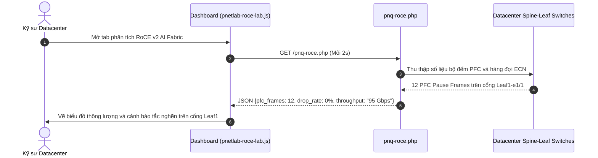

# SƠ ĐỒ TRÌNH TỰ (SEQUENCE DIAGRAM): F40 - ROCE RDMA TELEMETRY

```mermaid
sequenceDiagram
    autonumber
    actor User as Kỹ sư Datacenter
    participant UI as Dashboard (pnetlab-roce-lab.js)
    participant API as pnq-roce.php
    participant Switches as Datacenter Spine-Leaf Switches

    User->>UI: Mở tab phân tích RoCE v2 AI Fabric
    UI->>API: GET /pnq-roce.php (Mỗi 2s)
    API->>Switches: Thu thập số liệu bộ đếm PFC và hàng đợi ECN
    Switches-->>API: 12 PFC Pause Frames trên cổng Leaf1-e1/1
    API-->>UI: JSON {pfc_frames: 12, drop_rate: 0%, throughput: "95 Gbps"}
    UI->>User: Vẽ biểu đồ thông lượng và cảnh báo tắc nghẽn trên cổng Leaf1
```
