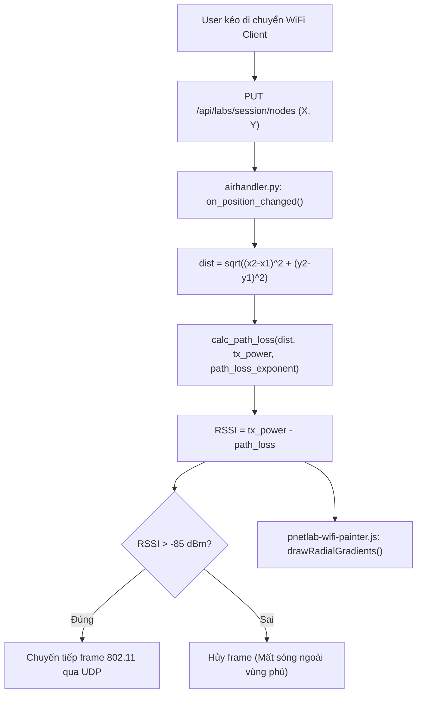

# SƠ ĐỒ GỌI HÀM (CALL GRAPH): F41 - VIRTUAL WIFI ENGINE

```mermaid
graph TD
    MOVE_NODE["User kéo di chuyển WiFi Client"] --> UPDATE_POS["PUT /api/labs/session/nodes (X, Y)"]
    UPDATE_POS --> AIR_DAEMON["airhandler.py: on_position_changed()"]
    AIR_DAEMON --> CALC_DIST["dist = sqrt((x2-x1)^2 + (y2-y1)^2)"]
    CALC_DIST --> LOG_LOSS["calc_path_loss(dist, tx_power, path_loss_exponent)"]
    LOG_LOSS --> RSSI_VAL["RSSI = tx_power - path_loss"]
    RSSI_VAL --> CHECK_THRESH{"RSSI > -85 dBm?"}
    CHECK_THRESH -- Đúng --> FORWARD_FRAME["Chuyển tiếp frame 802.11 qua UDP"]
    CHECK_THRESH -- Sai --> DROP_FRAME["Hủy frame (Mất sóng ngoài vùng phủ)"]
    RSSI_VAL --> PAINT_HEATMAP["pnetlab-wifi-painter.js: drawRadialGradients()"]
```
