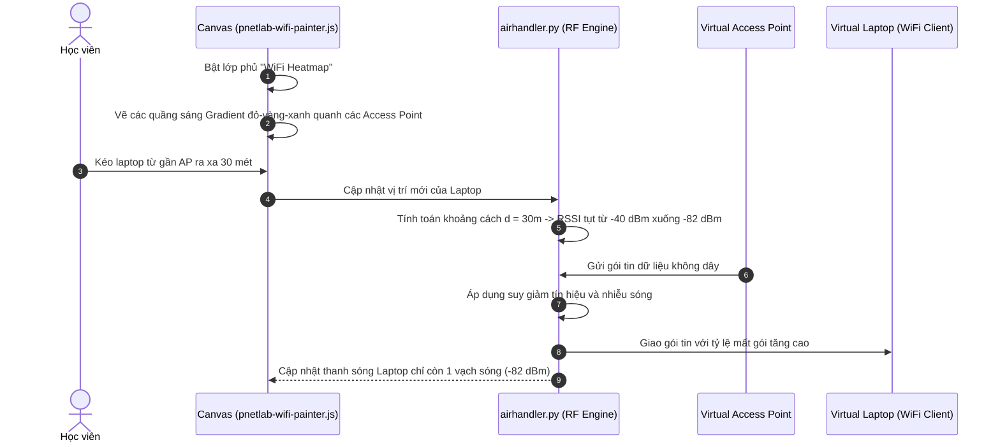

# SƠ ĐỒ TRÌNH TỰ (SEQUENCE DIAGRAM): F41 - VIRTUAL WIFI ENGINE

```mermaid
sequenceDiagram
    autonumber
    actor User as Học viên
    participant UI as Canvas (pnetlab-wifi-painter.js)
    participant Daemon as airhandler.py (RF Engine)
    participant AP as Virtual Access Point
    participant Client as Virtual Laptop (WiFi Client)

    UI->>UI: Bật lớp phủ "WiFi Heatmap"
    UI->>UI: Vẽ các quầng sáng Gradient đỏ-vàng-xanh quanh các Access Point
    User->>UI: Kéo laptop từ gần AP ra xa 30 mét
    UI->>Daemon: Cập nhật vị trí mới của Laptop
    Daemon->>Daemon: Tính toán khoảng cách d = 30m -> RSSI tụt từ -40 dBm xuống -82 dBm
    AP->>Daemon: Gửi gói tin dữ liệu không dây
    Daemon->>Daemon: Áp dụng suy giảm tín hiệu và nhiễu sóng
    Daemon->>Client: Giao gói tin với tỷ lệ mất gói tăng cao
    Daemon-->>UI: Cập nhật thanh sóng Laptop chỉ còn 1 vạch sóng (-82 dBm)
```
