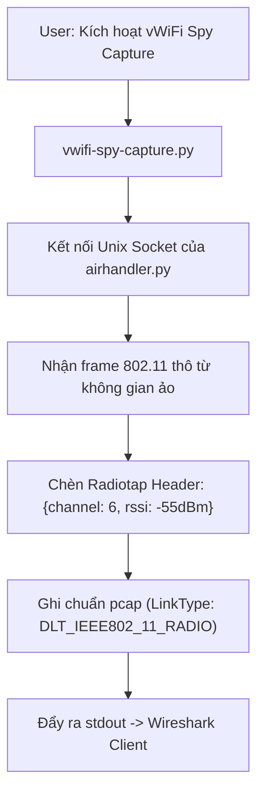

# SƠ ĐỒ GỌI HÀM (CALL GRAPH): F42 - VWIFI SPY CAPTURE

```mermaid
graph TD
    CLI_START["User: Kích hoạt vWiFi Spy Capture"] --> SCRIPT["vwifi-spy-capture.py"]
    SCRIPT --> CONNECT_AIR["Kết nối Unix Socket của airhandler.py"]
    CONNECT_AIR --> RECV_RAW["Nhận frame 802.11 thô từ không gian ảo"]
    RECV_RAW --> BUILD_RADIOTAP["Chèn Radiotap Header: {channel: 6, rssi: -55dBm}"]
    BUILD_RADIOTAP --> WRITE_PCAP["Ghi chuẩn pcap (LinkType: DLT_IEEE802_11_RADIO)"]
    WRITE_PCAP --> PIPE_WS["Đẩy ra stdout -> Wireshark Client"]
```
