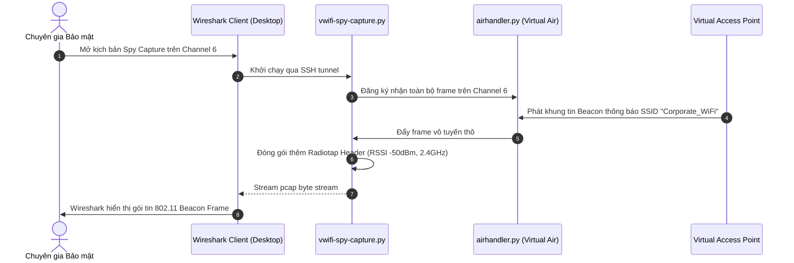

# SƠ ĐỒ TRÌNH TỰ (SEQUENCE DIAGRAM): F42 - VWIFI SPY CAPTURE

```mermaid
sequenceDiagram
    autonumber
    actor User as Chuyên gia Bảo mật
    participant WS as Wireshark Client (Desktop)
    participant Spy as vwifi-spy-capture.py
    participant Air as airhandler.py (Virtual Air)
    participant AP as Virtual Access Point

    User->>WS: Mở kịch bản Spy Capture trên Channel 6
    WS->>Spy: Khởi chạy qua SSH tunnel
    Spy->>Air: Đăng ký nhận toàn bộ frame trên Channel 6
    AP->>Air: Phát khung tin Beacon thông báo SSID "Corporate_WiFi"
    Air->>Spy: Đẩy frame vô tuyến thô
    Spy->>Spy: Đóng gói thêm Radiotap Header (RSSI -50dBm, 2.4GHz)
    Spy-->>WS: Stream pcap byte stream
    WS->>User: Wireshark hiển thị gói tin 802.11 Beacon Frame
```
