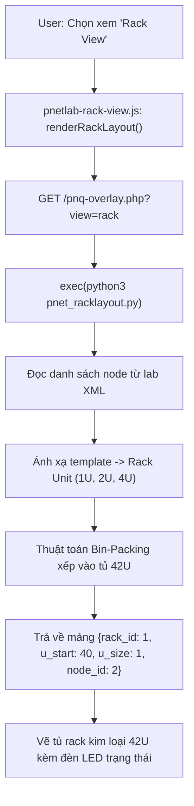

# SƠ ĐỒ GỌI HÀM (CALL GRAPH): F43 - DATACENTER RACK VIEW

```mermaid
graph TD
    CLICK["User: Chọn xem 'Rack View'"] --> UI["pnetlab-rack-view.js: renderRackLayout()"]
    UI --> API["GET /pnq-overlay.php?view=rack"]
    API --> PY_RACK["exec(python3 pnet_racklayout.py)"]
    PY_RACK --> READ_LAB["Đọc danh sách node từ lab XML"]
    READ_LAB --> MAP_RU["Ánh xạ template -> Rack Unit (1U, 2U, 4U)"]
    MAP_RU --> PACKING["Thuật toán Bin-Packing xếp vào tủ 42U"]
    PACKING --> JSON_OUT["Trả về mảng {rack_id: 1, u_start: 40, u_size: 1, node_id: 2}"]
    JSON_OUT --> DRAW_SVG["Vẽ tủ rack kim loại 42U kèm đèn LED trạng thái"]
```
