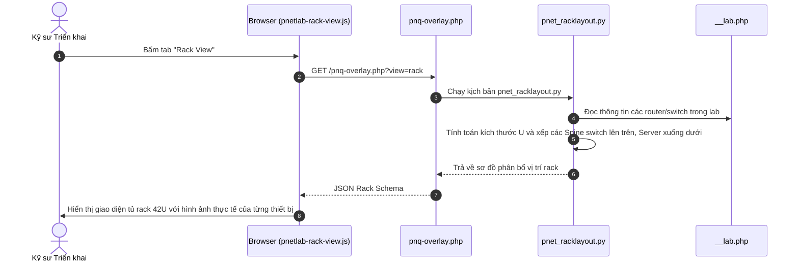

# SƠ ĐỒ TRÌNH TỰ (SEQUENCE DIAGRAM): F43 - DATACENTER RACK VIEW

```mermaid
sequenceDiagram
    autonumber
    actor User as Kỹ sư Triển khai
    participant UI as Browser (pnetlab-rack-view.js)
    participant API as pnq-overlay.php
    participant Python as pnet_racklayout.py
    participant LabModel as __lab.php

    User->>UI: Bấm tab "Rack View"
    UI->>API: GET /pnq-overlay.php?view=rack
    API->>Python: Chạy kịch bản pnet_racklayout.py
    Python->>LabModel: Đọc thông tin các router/switch trong lab
    Python->>Python: Tính toán kích thước U và xếp các Spine switch lên trên, Server xuống dưới
    Python-->>API: Trả về sơ đồ phân bổ vị trí rack
    API-->>UI: JSON Rack Schema
    UI->>User: Hiển thị giao diện tủ rack 42U với hình ảnh thực tế của từng thiết bị
```
