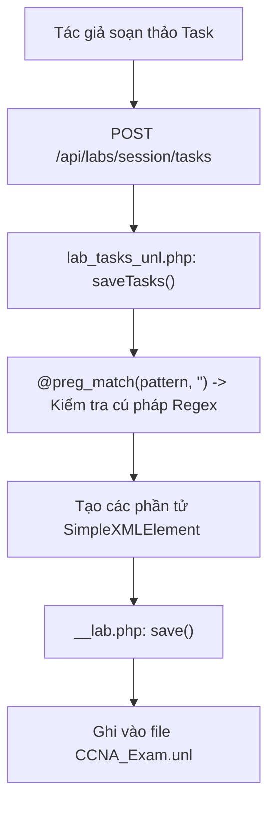

# SƠ ĐỒ GỌI HÀM (CALL GRAPH): F44 - TASK DEFINITION

```mermaid
graph TD
    EDIT_TASK["Tác giả soạn thảo Task"] --> API["POST /api/labs/session/tasks"]
    API --> TASK_MGR["lab_tasks_unl.php: saveTasks()"]
    TASK_MGR --> VALIDATE_REGEX["@preg_match(pattern, '') -> Kiểm tra cú pháp Regex"]
    VALIDATE_REGEX --> BUILD_XML["Tạo các phần tử SimpleXMLElement <task>"]
    BUILD_XML --> SAVE_LAB["__lab.php: save()"]
    SAVE_LAB --> FILE_WRITE["Ghi vào file CCNA_Exam.unl"]
```
