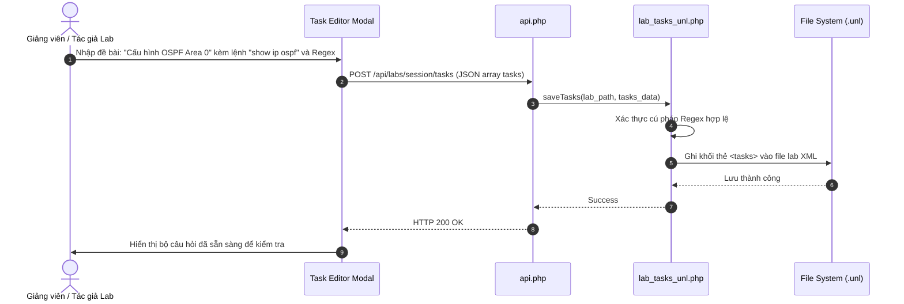

# SƠ ĐỒ TRÌNH TỰ (SEQUENCE DIAGRAM): F44 - TASK DEFINITION

```mermaid
sequenceDiagram
    autonumber
    actor Instructor as Giảng viên / Tác giả Lab
    participant UI as Task Editor Modal
    participant API as api.php
    participant TaskMgr as lab_tasks_unl.php
    participant Storage as File System (.unl)

    Instructor->>UI: Nhập đề bài: "Cấu hình OSPF Area 0" kèm lệnh "show ip ospf" và Regex
    UI->>API: POST /api/labs/session/tasks (JSON array tasks)
    API->>TaskMgr: saveTasks(lab_path, tasks_data)
    TaskMgr->>TaskMgr: Xác thực cú pháp Regex hợp lệ
    TaskMgr->>Storage: Ghi khối thẻ <tasks> vào file lab XML
    Storage-->>TaskMgr: Lưu thành công
    TaskMgr-->>API: Success
    API-->>UI: HTTP 200 OK
    UI->>Instructor: Hiển thị bộ câu hỏi đã sẵn sàng để kiểm tra
```
