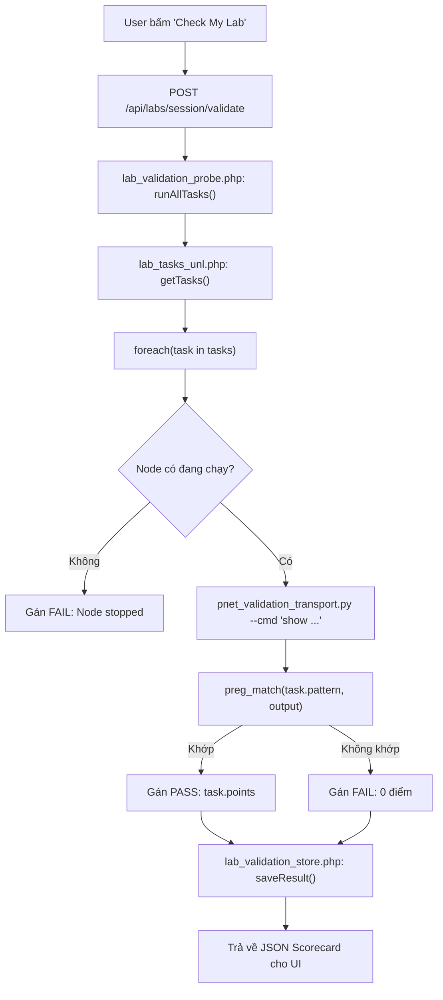

# SƠ ĐỒ GỌI HÀM (CALL GRAPH): F45 - PROBE ENGINE

```mermaid
graph TD
    CLICK["User bấm 'Check My Lab'"] --> POST_VAL["POST /api/labs/session/validate"]
    POST_VAL --> PROBE_CORE["lab_validation_probe.php: runAllTasks()"]
    PROBE_CORE --> LOAD_TASKS["lab_tasks_unl.php: getTasks()"]
    LOAD_TASKS --> LOOP_TASKS["foreach(task in tasks)"]
    LOOP_TASKS --> CHECK_NODE_ALIVE{"Node có đang chạy?"}
    CHECK_NODE_ALIVE -- Không --> FAIL_NODE["Gán FAIL: Node stopped"]
    CHECK_NODE_ALIVE -- Có --> EXEC_CLI["pnet_validation_transport.py --cmd 'show ...'"]
    EXEC_CLI --> REGEX_MATCH["preg_match(task.pattern, output)"]
    REGEX_MATCH -- Khớp --> PASS_TASK["Gán PASS: task.points"]
    REGEX_MATCH -- Không khớp --> FAIL_TASK["Gán FAIL: 0 điểm"]
    PASS_TASK --> STORE["lab_validation_store.php: saveResult()"]
    FAIL_TASK --> STORE
    STORE --> RESP["Trả về JSON Scorecard cho UI"]
```
