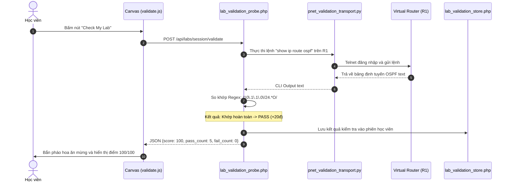

# SƠ ĐỒ TRÌNH TỰ (SEQUENCE DIAGRAM): F45 - PROBE ENGINE

```mermaid
sequenceDiagram
    autonumber
    actor Student as Học viên
    participant UI as Canvas (validate.js)
    participant Probe as lab_validation_probe.php
    participant Trans as pnet_validation_transport.py
    participant Router as Virtual Router (R1)
    participant Store as lab_validation_store.php

    Student->>UI: Bấm nút "Check My Lab"
    UI->>Probe: POST /api/labs/session/validate
    Probe->>Trans: Thực thi lệnh "show ip route ospf" trên R1
    Trans->>Router: Telnet đăng nhập và gửi lệnh
    Router-->>Trans: Trả về bảng định tuyến OSPF text
    Trans-->>Probe: CLI Output text
    Probe->>Probe: So khớp Regex: /10\.1\.1\.0\/24.*O/
    Note over Probe: Kết quả: Khớp hoàn toàn -> PASS (+20đ)
    Probe->>Store: Lưu kết quả kiểm tra vào phiên học viên
    Probe-->>UI: JSON {score: 100, pass_count: 5, fail_count: 0}
    UI->>Student: Bắn pháo hoa ăn mừng và hiển thị điểm 100/100
```
