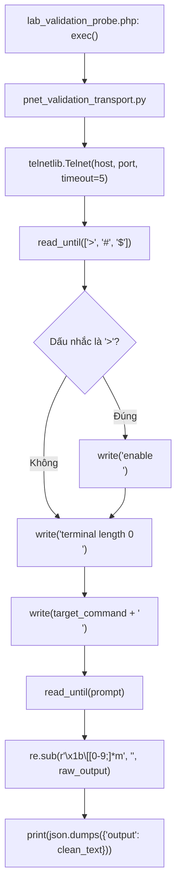

# SƠ ĐỒ GỌI HÀM (CALL GRAPH): F46 - TRANSPORT EXECUTOR

```mermaid
graph TD
    CALL["lab_validation_probe.php: exec()"] --> SCRIPT["pnet_validation_transport.py"]
    SCRIPT --> TELNET_CONN["telnetlib.Telnet(host, port, timeout=5)"]
    TELNET_CONN --> READ_PROMPT["read_until(['>', '#', '$'])"]
    READ_PROMPT --> ESCALATE{"Dấu nhắc là '>'?"}
    ESCALATE -- Đúng --> SEND_EN["write('enable\n')"]
    ESCALATE -- Không --> DISABLE_PAGING["write('terminal length 0\n')"]
    SEND_EN --> DISABLE_PAGING
    DISABLE_PAGING --> SEND_CMD["write(target_command + '\n')"]
    SEND_CMD --> READ_OUTPUT["read_until(prompt)"]
    READ_OUTPUT --> CLEAN_TEXT["re.sub(r'\x1b\[[0-9;]*m', '', raw_output)"]
    CLEAN_TEXT --> JSON_STDOUT["print(json.dumps({'output': clean_text}))"]
```
