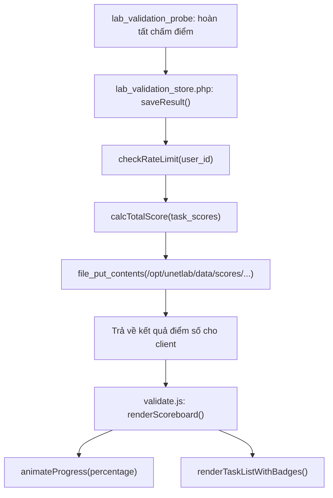

# SƠ ĐỒ GỌI HÀM (CALL GRAPH): F47 - SCORE & PROGRESS REPORTING

```mermaid
graph TD
    PROBE_DONE["lab_validation_probe: hoàn tất chấm điểm"] --> STORE_CALL["lab_validation_store.php: saveResult()"]
    STORE_CALL --> CHECK_RATE["checkRateLimit(user_id)"]
    CHECK_RATE --> CALC_TOTAL["calcTotalScore(task_scores)"]
    CALC_TOTAL --> WRITE_STORE["file_put_contents(/opt/unetlab/data/scores/...)"]
    WRITE_STORE --> JSON_RESP["Trả về kết quả điểm số cho client"]
    JSON_RESP --> UI_RENDER["validate.js: renderScoreboard()"]
    UI_RENDER --> ANIM_BAR["animateProgress(percentage)"]
    UI_RENDER --> DRAW_CHECKLIST["renderTaskListWithBadges()"]
```
