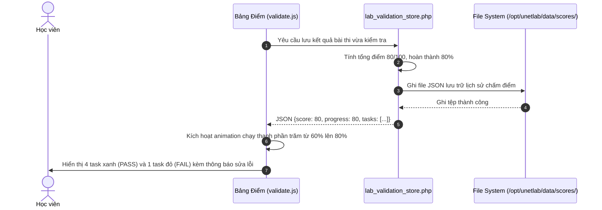

# SƠ ĐỒ TRÌNH TỰ (SEQUENCE DIAGRAM): F47 - SCORE & PROGRESS REPORTING

```mermaid
sequenceDiagram
    autonumber
    actor Student as Học viên
    participant UI as Bảng Điểm (validate.js)
    participant Store as lab_validation_store.php
    participant Storage as File System (/opt/unetlab/data/scores/)

    UI->>Store: Yêu cầu lưu kết quả bài thi vừa kiểm tra
    Store->>Store: Tính tổng điểm 80/100, hoàn thành 80%
    Store->>Storage: Ghi file JSON lưu trữ lịch sử chấm điểm
    Storage-->>Store: Ghi tệp thành công
    Store-->>UI: JSON {score: 80, progress: 80, tasks: [...]}
    UI->>UI: Kích hoạt animation chạy thanh phần trăm từ 60% lên 80%
    UI->>Student: Hiển thị 4 task xanh (PASS) và 1 task đỏ (FAIL) kèm thông báo sửa lỗi
```
