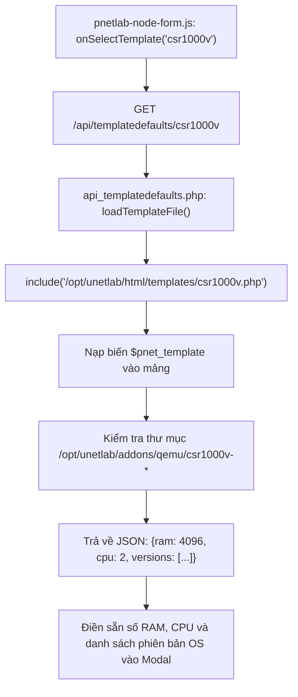

# SƠ ĐỒ GỌI HÀM (CALL GRAPH): F48 - TEMPLATE SCHEMA

```mermaid
graph TD
    FORM_OPEN["pnetlab-node-form.js: onSelectTemplate('csr1000v')"] --> GET_API["GET /api/templatedefaults/csr1000v"]
    GET_API --> SCANNER["api_templatedefaults.php: loadTemplateFile()"]
    SCANNER --> INCLUDE_PHP["include('/opt/unetlab/html/templates/csr1000v.php')"]
    INCLUDE_PHP --> POPULATE["Nạp biến $pnet_template vào mảng"]
    POPULATE --> CHECK_IMAGE["Kiểm tra thư mục /opt/unetlab/addons/qemu/csr1000v-*"]
    CHECK_IMAGE --> RESP_JSON["Trả về JSON: {ram: 4096, cpu: 2, versions: [...]}"]
    RESP_JSON --> POPULATE_FORM["Điền sẵn số RAM, CPU và danh sách phiên bản OS vào Modal"]
```
