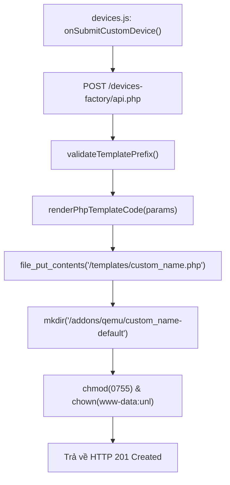

# SƠ ĐỒ GỌI HÀM (CALL GRAPH): F49 - CUSTOM DEVICE FACTORY

```mermaid
graph TD
    WIZARD["devices.js: onSubmitCustomDevice()"] --> POST_API["POST /devices-factory/api.php"]
    POST_API --> VALIDATE["validateTemplatePrefix()"]
    VALIDATE --> GEN_CODE["renderPhpTemplateCode(params)"]
    GEN_CODE --> WRITE_PHP["file_put_contents('/templates/custom_name.php')"]
    WRITE_PHP --> MKDIR_ADDON["mkdir('/addons/qemu/custom_name-default')"]
    MKDIR_ADDON --> CHMOD["chmod(0755) & chown(www-data:unl)"]
    CHMOD --> RESP["Trả về HTTP 201 Created"]
```
