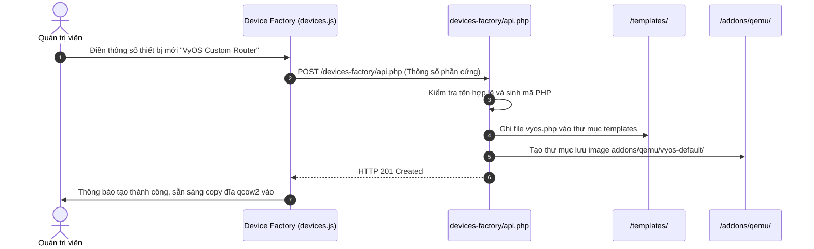

# SƠ ĐỒ TRÌNH TỰ (SEQUENCE DIAGRAM): F49 - CUSTOM DEVICE FACTORY

```mermaid
sequenceDiagram
    autonumber
    actor Admin as Quản trị viên
    participant UI as Device Factory (devices.js)
    participant API as devices-factory/api.php
    participant Templates as /templates/
    participant Addons as /addons/qemu/

    Admin->>UI: Điền thông số thiết bị mới "VyOS Custom Router"
    UI->>API: POST /devices-factory/api.php (Thông số phần cứng)
    API->>API: Kiểm tra tên hợp lệ và sinh mã PHP
    API->>Templates: Ghi file vyos.php vào thư mục templates
    API->>Addons: Tạo thư mục lưu image addons/qemu/vyos-default/
    API-->>UI: HTTP 201 Created
    UI->>Admin: Thông báo tạo thành công, sẵn sàng copy đĩa qcow2 vào
```
