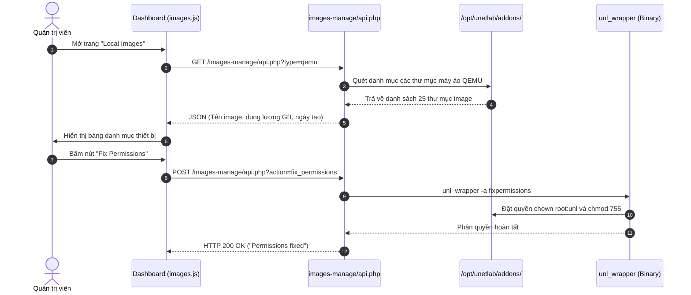

# SƠ ĐỒ TRÌNH TỰ (SEQUENCE DIAGRAM): F50 - IMAGE FILESYSTEM MANAGER

```mermaid
sequenceDiagram
    autonumber
    actor Admin as Quản trị viên
    participant UI as Dashboard (images.js)
    participant API as images-manage/api.php
    participant Storage as /opt/unetlab/addons/
    participant Wrapper as unl_wrapper (Binary)

    Admin->>UI: Mở trang "Local Images"
    UI->>API: GET /images-manage/api.php?type=qemu
    API->>Storage: Quét danh mục các thư mục máy ảo QEMU
    Storage-->>API: Trả về danh sách 25 thư mục image
    API-->>UI: JSON (Tên image, dung lượng GB, ngày tạo)
    UI->>Admin: Hiển thị bảng danh mục thiết bị
    Admin->>UI: Bấm nút "Fix Permissions"
    UI->>API: POST /images-manage/api.php?action=fix_permissions
    API->>Wrapper: unl_wrapper -a fixpermissions
    Wrapper->>Storage: Đặt quyền chown root:unl và chmod 755
    Wrapper-->>API: Phân quyền hoàn tất
    API-->>UI: HTTP 200 OK ("Permissions fixed")
```
