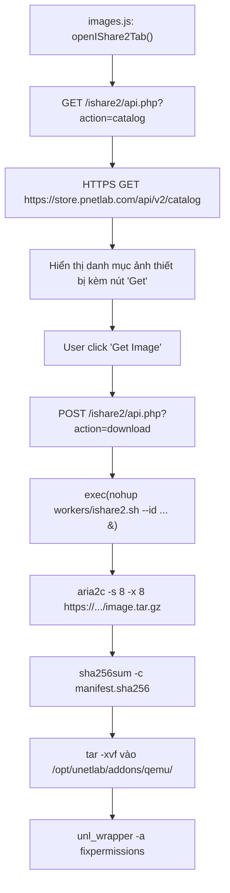

# SƠ ĐỒ GỌI HÀM (CALL GRAPH): F51 - ISHARE2 CLOUD STORE

```mermaid
graph TD
    BROWSE["images.js: openIShare2Tab()"] --> GET_CATALOG["GET /ishare2/api.php?action=catalog"]
    GET_CATALOG --> CLOUD_REQ["HTTPS GET https://store.pnetlab.com/api/v2/catalog"]
    CLOUD_REQ --> RENDER_GRID["Hiển thị danh mục ảnh thiết bị kèm nút 'Get'"]
    RENDER_GRID --> CLICK_DOWNLOAD["User click 'Get Image'"]
    CLICK_DOWNLOAD --> POST_DL["POST /ishare2/api.php?action=download"]
    POST_DL --> SPAWN_WORKER["exec(nohup workers/ishare2.sh --id ... &)"]
    SPAWN_WORKER --> ARIA2["aria2c -s 8 -x 8 https://.../image.tar.gz"]
    ARIA2 --> SHA256_CHECK["sha256sum -c manifest.sha256"]
    SHA256_CHECK --> UNPACK["tar -xvf vào /opt/unetlab/addons/qemu/"]
    UNPACK --> FIX_PERM["unl_wrapper -a fixpermissions"]
```
