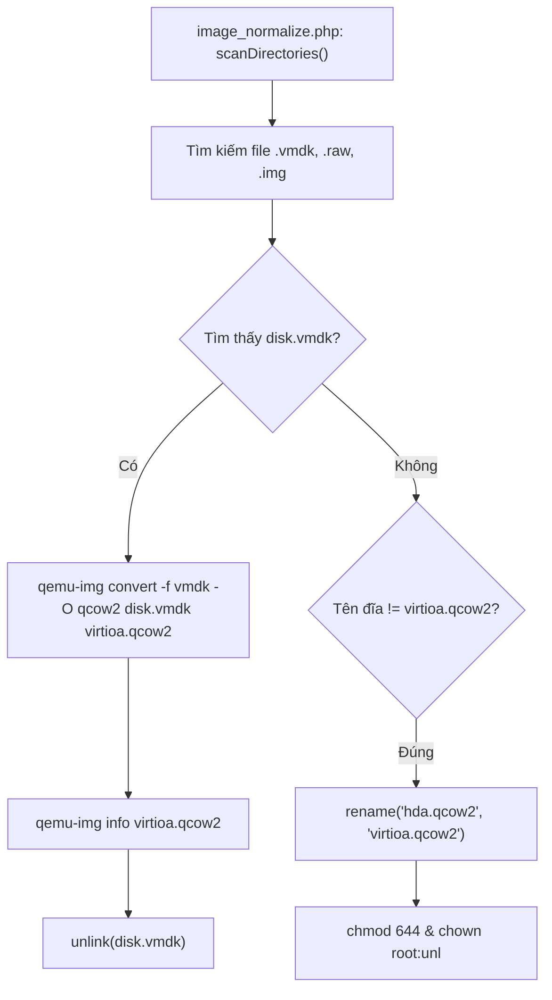

# SƠ ĐỒ GỌI HÀM (CALL GRAPH): F52 - IMAGE NORMALIZER

```mermaid
graph TD
    START["image_normalize.php: scanDirectories()"] --> DETECT_FILES["Tìm kiếm file .vmdk, .raw, .img"]
    DETECT_FILES --> FOUND_VMDK{"Tìm thấy disk.vmdk?"}
    FOUND_VMDK -- Có --> RUN_CONVERT["qemu-img convert -f vmdk -O qcow2 disk.vmdk virtioa.qcow2"]
    RUN_CONVERT --> VERIFY_QCOW2["qemu-img info virtioa.qcow2"]
    VERIFY_QCOW2 --> RM_VMDK["unlink(disk.vmdk)"]
    FOUND_VMDK -- Không --> CHECK_NAME{"Tên đĩa != virtioa.qcow2?"}
    CHECK_NAME -- Đúng --> RENAME_FILE["rename('hda.qcow2', 'virtioa.qcow2')"]
    RENAME_FILE --> FIX_PERM["chmod 644 & chown root:unl"]
```
