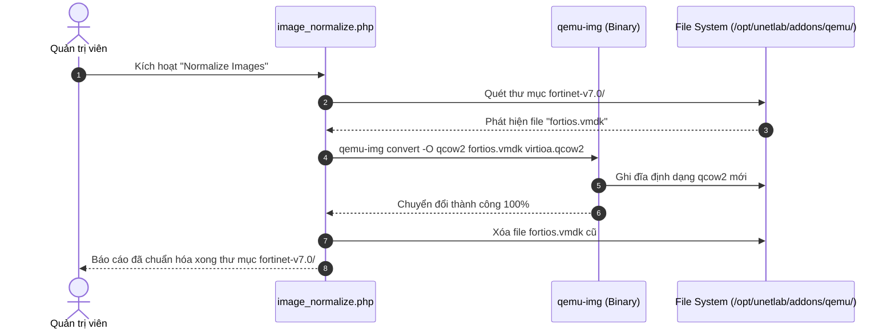

# SƠ ĐỒ TRÌNH TỰ (SEQUENCE DIAGRAM): F52 - IMAGE NORMALIZER

```mermaid
sequenceDiagram
    autonumber
    actor Admin as Quản trị viên
    participant API as image_normalize.php
    participant Tool as qemu-img (Binary)
    participant Storage as File System (/opt/unetlab/addons/qemu/)

    Admin->>API: Kích hoạt "Normalize Images"
    API->>Storage: Quét thư mục fortinet-v7.0/
    Storage-->>API: Phát hiện file "fortios.vmdk"
    API->>Tool: qemu-img convert -O qcow2 fortios.vmdk virtioa.qcow2
    Tool->>Storage: Ghi đĩa định dạng qcow2 mới
    Tool-->>API: Chuyển đổi thành công 100%
    API->>Storage: Xóa file fortios.vmdk cũ
    API-->>Admin: Báo cáo đã chuẩn hóa xong thư mục fortinet-v7.0/
```
